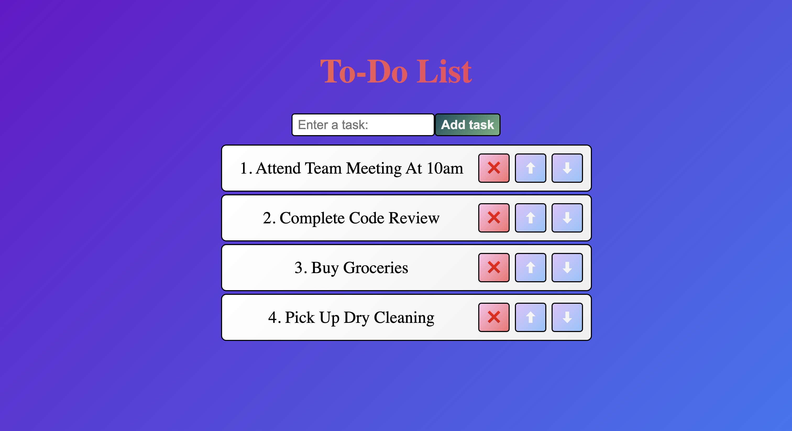

# ToDo List

## Overview
A simple ToDo list application built using React and Vite. This project allows users to add, edit, and remove tasks to manage their to-do items effectively.

## Features
- Add new tasks.
- Edit existing tasks.
- Remove tasks.
- Simple and responsive UI.

## Installation

1. Clone the repository:
   ```bash
   git clone https://github.com/RohitS511/ToDo-List.git
   ```

2. Install dependencies:
   ```bash
   npm install
   ```

3. Run the app:
   ```bash
   npm run dev
   ```

## Screenshot


## Contributing
Feel free to fork this repository and submit pull requests.
